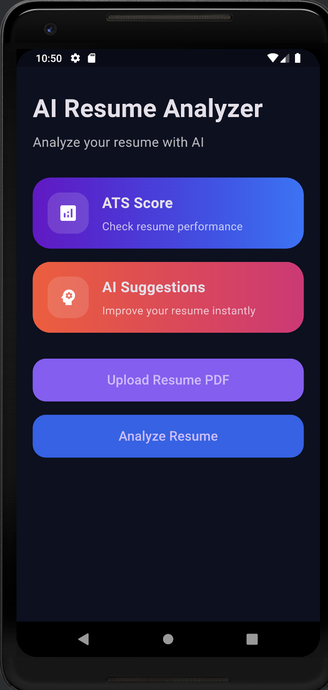
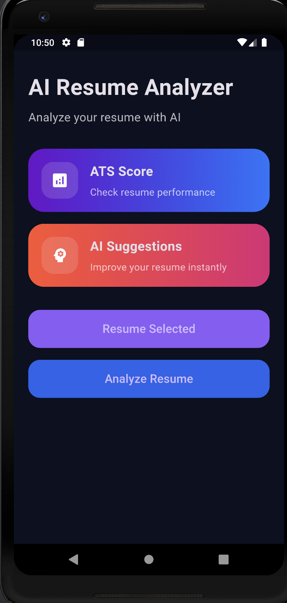
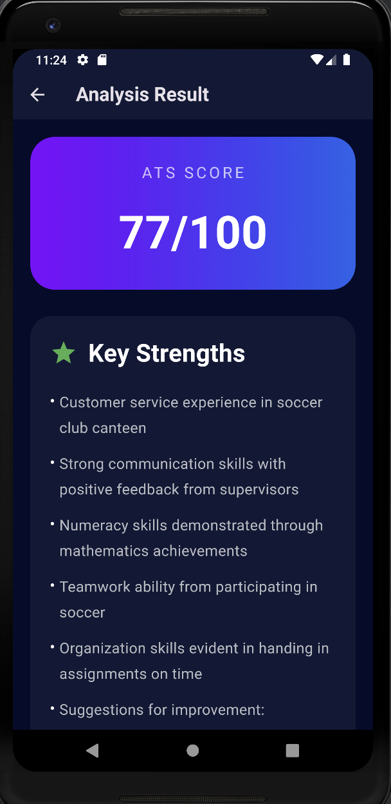
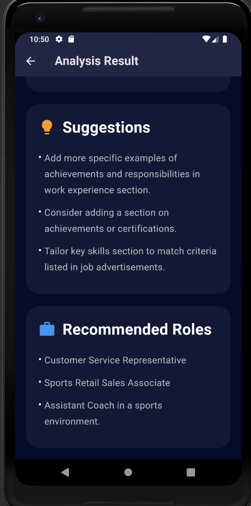

# AI Resume Analyzer

AI-powered Flutter app that analyzes resumes using AI and provides:

- ATS Score
- Key Strengths
- Missing Skills
- Improvement Suggestions
- Recommended Job Roles

Built using Flutter + OpenRouter API.

---

## Features

✨ Modern UI  
✨ Resume PDF Upload  
✨ AI Resume Analysis  
✨ ATS Score Detection  
✨ Suggestions for Improvement  
✨ Job Role Recommendations  
✨ Beautiful Result Screen  
✨ OpenRouter API Integration

---

## Tech Stack

- Flutter
- Dart
- OpenRouter API
- HTTP Package
- File Picker
- PDF Text Extraction

---
## Screenshots

### Home Screen


### Upload Resume


### AI Analyzing


### Analysis Result

---

## Installation

Clone the repository:

```bash
git clone https://github.com/tritvika2006-byte/ai-resume-analyzer.git
```

Go inside project:

```bash
cd ai-resume-analyzer
```

Install dependencies:

```bash
flutter pub get
```

Run app:

```bash
flutter run
```

---

## API Setup

This project uses OpenRouter API.

Create your own API key from:

https://openrouter.ai/

Then add it inside:

```dart
lib/services/gemini_service.dart
```

---

## Future Improvements

- Resume Templates
- AI Cover Letter Generator
- Download Analysis Report
- Firebase Authentication
- Cloud Storage
- Multiple Resume Themes

---

## Author

Ritvika Tiwari

Flutter Developer | AI App Builder
